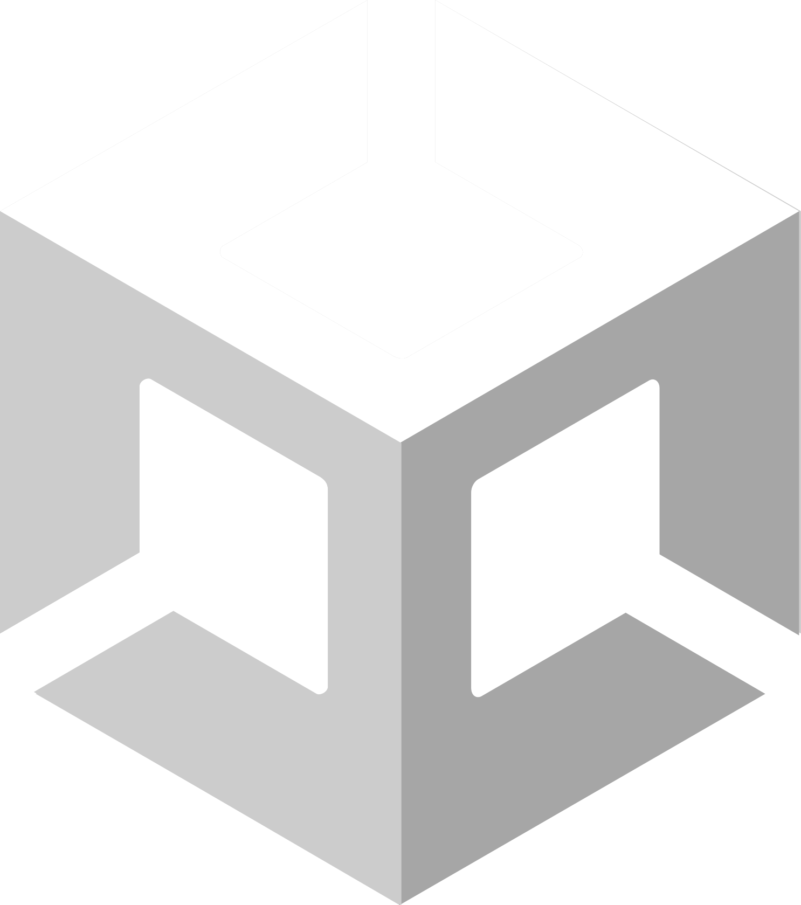

# Hey there, I'm Anthony! 👋
## About me
I'm a Junior at the <a href="https://www.cuny.edu" target="_blank" rel="noreferrer noopener">City University of New York</a> completing a personalized degree in Computer Science and Game Programming!

I'm also a Software Engineer intern at <a href="https://thedifferenceapp.com/" target="_blank" rel="noreferrer noopener">The Difference</a>!

I've been programming since junior year of high school and have loved it ever since. I love learning about new technologies and helping drive things that I'm passionate about forward. 

My current focus is developing my knowledge of XR and Mobile App Development!

## My technologies of choice/interests

Here are some of the technologies I use on a daily basis for projects, work, and to build my knowledge!

Favorites:     

All of them in a table:
|Tech|Main Driver|Have made projects using it|Learning|Have some knowledge|
|:--|---|---|---|---|
|Systems|   |   |    |
|Game Development|  |     |    |    |
|Mobile App Development|       |        |     |    |
|Web Development||          |    |    |

<!-- 
 -->

 

<!--
**lausan3/lausan3** is a ✨ _special_ ✨ repository because its `README.md` (this file) appears on your GitHub profile.l

Here are some ideas to get you started:

- 🔭 I’m currently working on ..
- 🌱 I’m currently learning ...
- 👯 I’m looking to collaborate on ...
- 🤔 I’m looking for help with ...
- 💬 Ask me about ...
- 📫 How to reach me: ...
- 😄 Pronouns: ...
- ⚡ Fun fact: ...
-->
